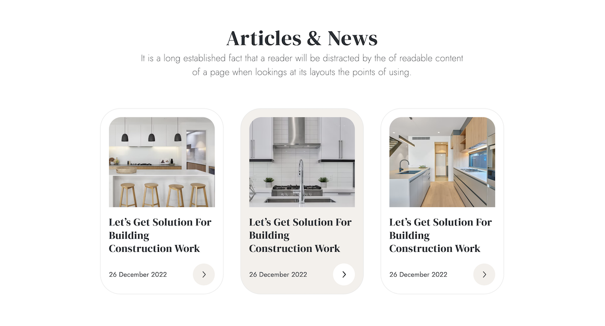

This repository contains the source code for the Interno website, created as a practice project to enhance skills in website layouts and CSS flexbox. Please note that this project is not currently functional and serves as a learning exercise.

Designed from [this Figma file](<https://www.figma.com/file/t2frPeNMqsrTnfLHuMHlXD/Interior-Design-Webflow-Website-Template-(Community)?type=design&node-id=1-5&mode=design&t=hK9S6hrALaf2dzEK-0>)

## Table of Contents

- [Introduction](#introduction)
- [Features](#features)
- [Getting Started](#getting-started)
- [Usage](#usage)
- [Contributing](#contributing)

 

## Introduction

The Interno website is a non-functional project built using HTML and styled with CSS. It has been developed to practice website layouts and explore the capabilities of CSS flexbox. The website consists of multiple pages, each focusing on different aspects of the business such as home, projects, reviews, and articles.

## Features

- **Navigation**: A navigation bar with a logo and menu items for easy navigation.
- **Hero Section**: A visually appealing hero section with a captivating image, title, subtitle, and a call-to-action button.
- **Read More**: Informative sections with titles, paragraphs, and "Read more" links for users interested in specific topics.
- **About Us**: A dedicated page providing information about Interno, its mission, and services.
- **Reviews**: Customer reviews with images, names, locations, and detailed feedback.
- **Projects**: Showcasing various projects with images, titles, categories, and icons.
- **Stats**: Displaying key statistics about Interno, including years of experience, successful projects, active projects, and satisfied customers.
- **Articles & News**: Articles with images, titles, publication dates.

## Getting Started

To view the Interno website locally, follow these steps:

1. Clone the repository: `git clone https://github.com/federedd/interno.git`
2. Open the `index.html` file in your preferred web browser.

## Usage

Feel free to explore the different pages and sections of the website. Although the project is not currently functional, it provides valuable insights into website layout practices and CSS flexbox usage.

## Contributing

If you'd like to contribute to the development of the Interno website practice project, please follow the steps below:

1. Fork the repository
2. Create a new branch: `git checkout -b feature/new-feature`
3. Make your changes and commit them: `git commit -m 'Add new feature'`
4. Push to the branch: `git push origin feature/new-feature`
5. Submit a pull request
